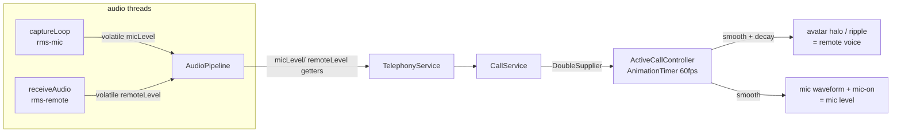

# Plan — Active-Call Icon Fix · Audio-Reactive Motion · Mic Waveform · Device Switching

> Status: **SHIPPED.** All four asks implemented across Phases 1–3; `./gradlew build` green (all module tests pass).
> Trigger (verbatim): *"fix the icons when hover and clicked, add a lot of motion when voice is coming and show wav and audio motions to represent if mic is on, should be able to change the mic and audio devices as well, plan this properly first before executing this."*
> Builds on the already-shipped [calling-screen.md](.plan/calling-screen.md) and [audio-device-fix.md](.plan/audio-device-fix.md). The calling screen, Ikonli icons, disposition chips, recording, secure SIP+SRTP, and the Settings device picker are **already built** — this plan extends them.

---

## 0. The four asks → features

| # | Ask | Feature | Layer(s) touched |
|---|---|---|---|
| 1 | "fix the icons when hover and clicked" | **Call-control icon/state CSS fix** | `ui` (CSS only) |
| 2 | "a lot of motion when voice is coming" | **Remote-voice-reactive avatar halo/ripple** | `telephony` → `services` → `ui` |
| 3 | "show wav and audio motions … if mic is on" | **Live mic waveform + mic-on indicator** | `telephony` → `services` → `ui` |
| 4 | "change the mic and audio devices as well" | **In-call mic/speaker switch (live) + reuse Settings** | `telephony` → `services` → `app` → `ui` |

Features 2 + 3 share one mechanism (an audio-level pull path), so they're designed together.

---

## 1. What already exists (reuse, don't rebuild)

- **[AudioPipeline.java](src/telephony/src/main/java/com/elitale/coldbirds/coldcalling/telephony/rtp/AudioPipeline.java)** — mic capture loop already computes an RMS for silence suppression (`isSilent`), and `receiveAudio(short[])` already handles every inbound frame. Both run **off the FX thread** (capture on a virtual thread; receive on the jlibrtp thread). These are the exact two tap points for mic/remote levels.
- **[AudioDeviceManager.java](src/telephony/src/main/java/com/elitale/coldbirds/coldcalling/telephony/audio/AudioDeviceManager.java)** — already enumerates capability-filtered, deduped input/output devices and resolves an id → `Mixer.Info`. The in-call menu mirrors these lists.
- **[AudioDeviceTester.java](src/telephony/src/main/java/com/elitale/coldbirds/coldcalling/telephony/audio/AudioDeviceTester.java)** — already has a pure, unit-tested `rms(short[]) → 0..1`. We extract that into a shared util so the pipeline and the tester share one implementation.
- **[TelephonyService.java](src/telephony/src/main/java/com/elitale/coldbirds/coldcalling/telephony/TelephonyService.java)** — owns `activePipeline` + `activeRtp` + `activeRecorder`; already has `setAudioDevices(in, out)` (volatile, applies to the **next** call). We add level getters + a **mid-call** `switchAudioDevices`.
- **[ActiveCallController.java](src/ui/src/main/java/com/elitale/coldbirds/coldcalling/ui/controller/ActiveCallController.java)** — already has the `haloCircle`, the state ring, a `pulseTimer` (fixed `Timeline`), phase machine, and `runOnFx`. We add an `AnimationTimer` and a waveform node.
- **[cupertino-light.css](src/ui/src/main/resources/css/cupertino-light.css#L1358)** — `.call-control` styles. Light theme only (no dark CSS in the repo), so the icon fix is one file.
- Device application path already wired: [`applyAudioDevices()`](src/app/src/main/java/com/elitale/coldbirds/coldcalling/app/ColdCallingApp.java#L333) (`BiConsumer<String,String>`) + saved-device resolve at startup. We add a sibling for live switching.

---

## 2. Feature 1 — Fix call-control icons on hover/click (CSS only)

### 2.1 Root cause
`.call-control` defines **base + `:hover` + `:disabled`** only. Two consequences:
1. The base rule never pins the glyph color (`.call-control .ikonli-font-icon` has no `-fx-icon-color`), so the icon inherits and can wash out when the background shifts.
2. There are **no `:armed` / `:pressed` / `:focused` rules**, so on mouse-down and on focus the button falls back to the **AtlantaFX/Modena base `.button`** background + focus ring, which overrides the circular custom fill — the button visibly "breaks" (changes shape/fill, glyph loses contrast) exactly when pressed or focused.

### 2.2 Fix (append to the `.call-control` block in [cupertino-light.css](src/ui/src/main/resources/css/cupertino-light.css#L1358))
- Pin the glyph + label color at rest: `.call-control .ikonli-font-icon { -fx-icon-color: -cc-text-secondary; }`.
- Cover **every interaction pseudo-state** so the circular fill is preserved and never reverts to the theme default:
  - `:hover` / `:focused` → current hover fill, on-brand subtle accent focus ring (not the Modena blue ring).
  - `:armed`, `:pressed`, `:focused:armed` → a slightly darker fill (`derive(-cc-bg-elevated, -8%)`), no shape change.
- Mirror the same armed/pressed/focused coverage for `.call-control--on` (keep accent fill + white glyph) and `.call-control--danger` (keep red fill + white glyph; `:hover` already exists, add armed/pressed/focused).
- Keep `:disabled { -fx-opacity: 0.4 }` as-is (the dimmed look in the wrap-up screenshot is **by design**, not the bug).

**No Java/FXML changes.** Verify visually after: hover, mouse-down, Tab-focus, and the `--on`/`--danger` toggles.

### 2.3 (Optional, only if wanted) state-correct tints
The [calling-screen.md](.plan/calling-screen.md) spec calls for **Mute = red tint** and **Hold = amber tint** when engaged; today both use the accent `--on`. Adding `.call-control--muted` / `.call-control--hold` variants is a tiny CSS+toggle change. **Flagged, not assumed** — confirm if you want it in this pass.

---

## 3. Features 2 + 3 — audio-reactive motion (shared level path)

### 3.1 Design principle (locked by [audio-device-fix.md](.plan/audio-device-fix.md))
> "Level meter updates via an `AnimationTimer` polling a `volatile double` (no `runLater` flooding). Never touch lines on the FX thread."

So we use a **pull** model, not per-frame callbacks: the audio threads write `volatile double`s; the FX `AnimationTimer` (~60 fps) reads + smooths them. No new cross-thread callback plumbing, no flooding.

### 3.2 Data flow

### 3.3 `telephony` changes
- **New `AudioLevels` util** (package `…telephony.audio`, pure, ~15 lines): `static double rms(short[])` normalized 0..1. Refactor `AudioPipeline.isSilent` and `AudioDeviceTester.rms` to delegate to it (DRY of *behavior*, not premature). Fully unit-tested without hardware.
- **[AudioPipeline](src/telephony/src/main/java/com/elitale/coldbirds/coldcalling/telephony/rtp/AudioPipeline.java):** add `private volatile double micLevel, remoteLevel;`. Set `micLevel = AudioLevels.rms(pcm)` in the capture loop (every 20 ms, always — mute styling is a UI concern) and `remoteLevel = AudioLevels.rms(pcm)` in `receiveAudio`. Add `double micLevel()` / `double remoteLevel()` getters. On `close()`, reset both to 0.
- **[TelephonyService](src/telephony/src/main/java/com/elitale/coldbirds/coldcalling/telephony/TelephonyService.java):** `double micLevel()` / `double remoteLevel()` → return the active pipeline's value, or `0` when no call.

### 3.4 `services` change
- **[CallService](src/services/src/main/java/com/elitale/coldbirds/coldcalling/services/CallService.java):** `double micLevel()` / `double remoteLevel()` passthrough to `telephony`. (Keeps UI → services → telephony intact.)

### 3.5 `app` wiring
- Build `DoubleSupplier micLevel = callService::micLevel`, `remoteLevel = callService::remoteLevel`; pass both into `MainWindow.Dependencies` → `ActiveCallController`.

### 3.6 `ui` — motion
- **New support node `AudioWaveform`** (`…ui.support`, a thin `Canvas` subclass, ≤100 lines): keeps a rolling ring-buffer of recent mic levels and renders a scrolling bar/wave each `push(level)`. Pure render; FX-thread only. Unit-test the ring-buffer/index math (headless); the draw call is trivial.
- **[active-call-view.fxml](src/ui/src/main/resources/fxml/active-call-view.fxml):** add a `micMeter` (the `AudioWaveform`) + a small `bi-mic` "mic-on" glyph, placed under the status line (above the control row). `visible/managed=false` outside the Active/Hold phases.
- **[ActiveCallController](src/ui/src/main/java/com/elitale/coldbirds/coldcalling/ui/controller/ActiveCallController.java):**
  - Inject the two `DoubleSupplier`s (`setAudioLevels(micSupplier, remoteSupplier)` or via a small holder).
  - Add **one** `AnimationTimer`, started in `markConnected`/`startActive`, stopped in `markEnded`/`markFailed`/`dispose`. Each tick:
    - `remote = smooth(remoteSupplier)` → drive `haloCircle` scale + opacity (and an optional concentric **ripple** on loud frames) = "a lot of motion when voice is coming." This supersedes the fixed `pulseTimer` during Active (ringing keeps the existing fixed pulse).
    - `mic = muted ? 0 : smooth(micSupplier)` → `micMeter.push(mic)` and colour the mic-on glyph (active vs muted/grey).
  - Smoothing = exponential decay toward the polled value so motion is fluid and falls to rest on silence.
  - Reuse the existing `muted` field so the meter reads "off" when muted.

---

## 4. Feature 4 — change mic & speaker devices

Two surfaces:

### 4.1 Settings (already shipped) — verify only
The Settings → Audio picker + `applyAudioDevices()` already persists and applies devices to the **next** call. No redesign; just confirm it still works after the wiring changes.

### 4.2 In-call live switch (new) — the "•••" audio menu
Per [calling-screen.md §3.3](.plan/calling-screen.md), device switching is **demoted to a small menu on the call card** (not a primary button). Today the card's top-right is the `closeButton` (✕); we add a dedicated **audio-devices** control (`bi-mic`/gear) opening a popup:
- `Microphone ▸` — `audioDeviceManager.inputDevices()`, current one checked (`bi-check`).
- `Speaker ▸` — `audioDeviceManager.outputDevices()`, current one checked.
- Selecting a device applies it **live** and write-through-saves it (so it sticks).

**Live switch mechanism (telephony):**
- New `TelephonyService.switchAudioDevices(Mixer.Info in, Mixer.Info out)`:
  - Always update the volatile fields (so the next call uses them too).
  - If a call is active (`activePipeline != null`): rebuild **only the pipeline** on the existing `activeRtp` — close the old `AudioPipeline` (not the RTP session), construct a new one bound to `activeRtp` with the new devices, **re-attach the existing `activeRecorder`** (do **not** create a new recorder — recording must continue to the same file), and `start()`. A brief (<100 ms) audio gap on switch is acceptable.
  - Runs off the FX thread (UI calls it via `CompletableFuture.runAsync`).
- `CallService.switchAudioDevices(in, out)` passthrough.
- `app`: build `BiConsumer<String,String> onSwitchDevices = (inId, outId) -> callService.switchAudioDevices(resolveInput(inId), resolveOutput(outId))` and (optionally) persist via `settingsService`. Inject `audioDeviceManager` + `onSwitchDevices` into the controller for the menu.

---

## 5. Module-boundary check (AGENTS.md)
- `domain` — untouched.
- `telephony` — `AudioLevels` util, `AudioPipeline` levels, `TelephonyService` getters + `switchAudioDevices`. No UI/storage deps. ✅
- `services` — thin passthroughs only. ✅
- `ui → telephony` is already an allowed edge (Settings injects `AudioDeviceManager`); the ••• menu reuses it. ✅
- No FX-thread audio I/O; no audio-thread FX calls (pull via `AnimationTimer`). ✅

---

## 6. TDD — tests first (per AGENTS.md)

| Test class | Cases |
|---|---|
| `AudioLevelsTest` (telephony, new) | silence → 0; full-scale → ≈1; empty/null → 0; matches old `isSilent` threshold behavior |
| `AudioPipelineTest` (extend) | `micLevel`/`remoteLevel` update after frames; reset to 0 on `close()` (use the existing hardware-free `LineFactory` seam) |
| `TelephonyServiceTest` (extend, if present) | level getters return 0 with no active call; `switchAudioDevices` with no call just updates fields (no NPE); with a faked active pipeline rebuilds + keeps the same recorder |
| `CallServiceTest` (extend) | `micLevel/remoteLevel/switchAudioDevices` delegate to telephony |
| `AudioWaveformTest` (ui support, new) | ring-buffer push/wrap + normalization math (headless, no Stage) |

Coverage targets unchanged: telephony ≥ 80%, services ≥ 90%, domain n/a. Hardware-touching paths guarded with `Assumptions`. The CSS fix and the `AnimationTimer`/halo wiring are validated by visual check (no controller unit-test harness exists in `ui` — consistent with the module's current convention).

---

## 7. Implementation order (bottom-up, phased)

**Phase 1 — Icon fix (smallest, independent, instant win).** CSS only → visual verify.

**Phase 2 — Level path + motion (features 2+3).**
1. `AudioLevels` + test; refactor `isSilent`/`rms` to use it.
2. `AudioPipeline` volatile levels + getters + test.
3. `TelephonyService` + `CallService` getters + tests.
4. `app` `DoubleSupplier` wiring → `MainWindow` → controller.
5. `AudioWaveform` node + test; FXML node; controller `AnimationTimer` (halo + waveform + mic-on).

**Phase 3 — Device switching (feature 4).**
6. `TelephonyService.switchAudioDevices` (pipeline rebuild, recorder-preserving) + test; `CallService` passthrough.
7. `app` `onSwitchDevices` + inject `AudioDeviceManager` into the controller.
8. ••• audio menu in the controller/FXML; write-through save.
9. `./gradlew build` + `./gradlew test` green; manual call smoke-test.

---

## 8. Deliberately NOT doing (YAGNI)
- No spectrum/FFT visualization — RMS-driven bars are enough for "is the mic live / is the caller talking."
- No per-device gain/volume sliders, no AGC.
- No mid-call **codec/format** change — fixed to G.711 8 kHz.
- No dark-theme variant (repo is light-only).
- No new floating HUD (separate item in the calling-screen plan).
- Mute = red / Hold = amber tints only if you opt into §2.3.

---

## 9. Open questions (please confirm before I execute)
1. **Waveform placement** — under the status line (centered, above the controls) as proposed, or beside the Mute button?
2. **Halo intensity** — subtle (tasteful pulse) vs. "a lot" (bigger scale + concentric ripples on loud speech)? You said "a lot of motion," so I'll lean energetic unless you prefer restrained.
3. **In-call device switch persistence** — apply live only, or also write-through to Settings (sticks for next launch)? Proposed: write-through.
4. **§2.3 mute-red / hold-amber tints** — include now or leave for later?
5. **Scope/phasing** — do all three phases now, or ship the icon fix (Phase 1) first for a quick visual confirm, then proceed?
