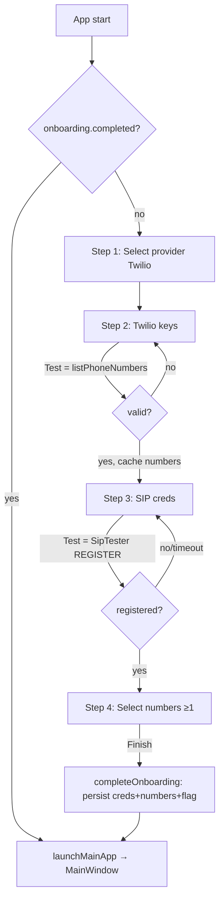

# Plan — First-Run Onboarding Wizard

> Status: **PLANNED** (not started). Locked product decisions live here. Build bottom-up, TDD.
> Owner module map follows AGENTS.md: domain → storage/providers/telephony → services → ui → app.

---

## 1. Goal

On first launch (or until completed), present a guided wizard that:

1. **Select provider** — show Twilio only (enabled); other providers shown as disabled "Coming soon" cards.
2. **Twilio API keys** — enter Account SID + Auth Token, **Test** them live.
3. **SIP** — enter SIP credentials, **Test** registration live.
4. **Numbers** — fetch all numbers on the Twilio account; user selects one / many / all (multi-select). At least one required.
5. **Finish** — persist creds + selected numbers, mark onboarding complete, launch the main app.

After completion the wizard never shows again unless settings are wiped.

---

## 2. Locked Product Decisions

- **Provider step**: Twilio is the only selectable option. Render other providers (e.g. Vonage, Telnyx, Plivo, Bandwidth) as **disabled cards with a "Coming soon" badge**. Selection state defaults to Twilio. No "skip provider" path.
- **One call = test + fetch**: The Twilio "Test" action calls `listPhoneNumbers()`. Success proves the keys are valid **and** yields the numbers used in step 4. Cache them in the wizard; do not re-fetch.
- **Test gating**: Each test step must pass before "Continue" is enabled. A failed test shows an inline error with the provider message; user can edit and retry. (Back is always allowed.)
- **SIP test**: A one-shot REGISTER attempt with a hard timeout (default **10s**). Outcomes: registered → pass; 401/403/registration-failed → fail with reason; timeout → fail "No response (check domain/proxy/network)".
- **SIP prefill**: Domain + proxy prefilled to `sip.twilio.com`, port `5060` (existing defaults). Username/password blank.
- **Numbers step**: Multi-select via checkboxes + a "Select all" toggle. **Finish disabled until ≥1 selected.** Persist only the selected subset.
- **Default number**: The first selected number is auto-set as the default (no extra UI). User can change later in Settings → General.
- **Persistence timing**: Persist Twilio creds and SIP creds at **Finish** (single commit), not per-step, so abandoning mid-wizard leaves no partial config. Selected numbers + `onboarding.completed=true` written in the same finish step.
- **Re-entrancy**: If the user quits mid-wizard, onboarding restarts from step 1 next launch (nothing persisted). KISS — no resume state.
- **No theme/appearance step** (that section was just removed).

---

## 3. Architecture & New Components

### 3.1 Domain (`domain/`)

- **`ProviderOption`** (record) — `record ProviderOption(String id, String displayName, boolean available)`.
  Static catalog `ProviderOptions.ALL` listing Twilio (available) + the rest (unavailable). Pure data, max 100 lines.
  - *YAGNI guard*: do **not** model this as a sealed interface or enum with behavior — it's display data only.

### 3.2 Telephony (`telephony/`)

- **`SipTester`** — one-shot registration probe. Spins up a transient `SipEngine` + `SipRegistrar`, attempts REGISTER, waits up to a timeout for `onRegistered` / `onRegistrationFailed`, tears everything down, returns the outcome.
  - API: `CompletableFuture<Result<Void>> test(SipCredentials creds, Duration timeout)`.
  - Reuses existing `SipEngine`/`SipRegistrar`; **no duplication of SIP plumbing**. Maps failure code+reason into `Result.err`.
  - Must always release sockets/threads in a `finally`/completion handler (no leaked ports).

### 3.3 Services (`services/`)

- **`OnboardingService`** — the only thing the UI talks to. Thin orchestration, max 200 lines.
  - `Result<List<TwilioNumberData>> testTwilio(String sid, String token)`
    - Builds a **transient** `TwilioClient` from `TwilioConfig.of(sid, token)` via an injected factory
      `Function<TwilioConfig, TwilioClient>` (default `TwilioClient::new`) — keeps it testable and avoids the stale singleton problem.
    - Returns `listPhoneNumbers()` result. Blank creds → `Result.err`.
  - `CompletableFuture<Result<Void>> testSip(SipCredentials creds)` → delegates to `SipTester.test(creds, DEFAULT_SIP_TEST_TIMEOUT)`.
  - `Result<Integer> completeOnboarding(OnboardingResult result)` — single commit:
    1. persist Twilio SID/token, SIP creds (via `SettingsService`),
    2. persist selected numbers (subset upsert, skip dupes/invalid — reuse the `syncNumber` logic; extract a shared private method or move into `PhoneNumberService.saveSelected(List<TwilioNumberData>)`),
    3. set first selected number as default,
    4. set `onboarding.completed = true`.
    - Returns count of numbers saved, or `Result.err` (nothing committed on failure — best-effort; document ordering).
  - `boolean isOnboardingComplete()` → reads the settings flag.
- **`OnboardingResult`** (record, can live in services or domain) — `String sid, String authToken, SipCredentials sip, List<TwilioNumberData> selectedNumbers`.
- **`PhoneNumberService.saveSelected(List<TwilioNumberData>)`** — new method; refactor `fetchAndSync`'s `syncNumber` into a reusable persist-one helper (DRY: extract shared *behavior*).
- **`SettingsService`** additions:
  - `KEY_ONBOARDING_COMPLETED = "onboarding.completed"`.
  - `boolean isOnboardingComplete()` (default `false`), `void setOnboardingComplete(boolean)`.

### 3.4 UI (`ui/`)

- **`onboarding-view.fxml`** — single wizard view: header (title + step indicator e.g. "Step 2 of 4"), a swappable content area with 4 step panes (toggle `visible`/`managed`), footer nav (Back / Continue / Finish + inline status label + progress spinner during tests).
- **`OnboardingController`** (max 250 lines; extract a helper if larger) — owns `currentStep`, validation gating, calls `OnboardingService` off the FX thread (`CompletableFuture` + `Platform.runLater`), caches fetched numbers between step 2 and 4, builds the `OnboardingResult`, invokes an `onComplete` callback when done.
  - Step panes:
    1. Provider cards (Twilio enabled, others disabled + "Coming soon").
    2. `TextField sid`, `PasswordField token`, **Test & Continue** button → spinner → inline ✓/✗.
    3. SIP fields (username, password, domain, proxy, port spinner; domain/proxy/port prefilled), **Test & Continue**.
    4. Number list: `ListView`/`VBox` of `CheckBox` rows + "Select all"; **Finish** enabled only when ≥1 checked.
  - Never blocks FX thread; every test shows a progress indicator and a recovery-capable error (per AGENTS §10.5).
- **`OnboardingWindow`** (small) — builds the scene for the wizard and exposes `show(Runnable onComplete)`. Mirrors how `MainWindow` is constructed. Injects `OnboardingService` + an `onComplete` callback.

### 3.5 App wiring (`app/ColdCallingApp`)

- **Restructure launch** so credential-dependent objects are built **after** creds are known:
  - `init()`: keep DB, repos, and non-credential services. Build `SettingsService`, `PhoneNumberService` deps, etc. Construct `OnboardingService` (with the `TwilioClient` factory + `SipTester`).
  - `start(Stage)`:
    - if `onboardingService.isOnboardingComplete()` → `launchMainApp(stage)` (current behavior).
    - else → `new OnboardingWindow(stage, onboardingService).show(() -> launchMainApp(stage))`.
  - **`launchMainApp(Stage)`** (extracted from today's `init`/`start`): builds `TwilioClient` from now-persisted creds, builds/starts `TelephonyService`, `SmsService` (+ inbound polling), wires `MainWindow`, runs initial `fetchAndSync`, shows the window.
    - This resolves the stale-singleton problem: `TwilioClient`/`TelephonyService` are constructed from the persisted creds onboarding just wrote.
  - Update class javadoc to mention the first-run wizard.

---

## 4. Flow Diagram



---

## 5. Implementation Phases (TDD, bottom-up)

> Red → Green → Refactor each phase. `./gradlew build` + `./gradlew test` green before moving on.

- **Phase 1 — Domain**: `ProviderOption` + `ProviderOptions.ALL`.
  - Tests: catalog contains Twilio available; others present and unavailable; list unmodifiable.
- **Phase 2 — Settings flag**: `SettingsService` onboarding flag getter/setter + key.
  - Tests: default false; set→get round-trip.
- **Phase 3 — `PhoneNumberService.saveSelected`**: extract persist-one helper, add subset save.
  - Tests: saves only given numbers; skips duplicates; skips invalid E.164; returns inserted count.
- **Phase 4 — `SipTester`** (telephony): one-shot register probe with timeout.
  - Tests (mock registrar listener / inject a fake registrar): registered→ok; failed code→err with reason; timeout→err; resources released. (Telephony target ≥80%; keep network out of unit tests via seam.)
- **Phase 5 — `OnboardingService`**: testTwilio (factory-injected client), testSip (delegate), completeOnboarding (single commit), isOnboardingComplete.
  - Tests: testTwilio ok/err + blank creds; completeOnboarding persists creds+numbers+default+flag and returns count; partial-failure behavior documented & asserted.
- **Phase 6 — UI**: `onboarding-view.fxml`, `OnboardingController`, `OnboardingWindow`.
  - Tests: step gating (continue disabled until test passes), finish disabled until ≥1 number, select-all toggles all, builds correct `OnboardingResult` (≥60% controller).
- **Phase 7 — App wiring**: extract `launchMainApp`, branch on onboarding flag, show wizard → callback.
  - Manual smoke + existing suite green.
- **Phase 8 — Docs/cleanup**: update README + copilot-instructions if they describe first-run; SOLID/KISS/YAGNI audit; full `./gradlew build` + `test`.

---

## 6. Files

**New**
- `domain/.../onboarding/ProviderOption.java`, `ProviderOptions.java`
- `telephony/.../sip/SipTester.java` (+ test)
- `services/.../OnboardingService.java` (+ test), `OnboardingResult.java`
- `ui/.../controller/OnboardingController.java` (+ test), `ui/.../OnboardingWindow.java`
- `ui/src/main/resources/fxml/onboarding-view.fxml`

**Modified**
- `services/.../SettingsService.java` (flag), `PhoneNumberService.java` (`saveSelected` + extracted helper)
- `app/.../ColdCallingApp.java` (`launchMainApp` extraction + onboarding branch)
- README / copilot-instructions (first-run note) — optional, confirm before editing docs.

---

## 7. Risks / Open Questions

- **SIP one-shot test reliability**: registration is async over UDP; the 10s timeout + transient registrar must clean up sockets. If transient registration proves flaky, fallback: allow "Skip SIP test" with a warning (decide if needed — default is *required*).
- **Twilio creds for the test must not be the stale singleton** — solved by the transient-client factory in `OnboardingService`.
- **`completeOnboarding` atomicity**: settings + numbers are separate writes (no cross-table txn helper today). Order: write numbers first, flag last, so a crash mid-commit re-runs onboarding rather than locking the user out. Confirm acceptable.
- **Default-number choice**: auto-pick first selected vs. let user pick in step 4. Locked to auto-pick (KISS); revisit if buyer/va agents push back.

---

## 8. Suggested validation

Run the `buyer` and `va` subagents against this flow (provider gating, forced SIP test, multi-select numbers) before building Phase 6 UI — cheap way to catch friction (e.g. "forced SIP test blocks me if Twilio SIP is slow").

---

## 9. UI / UX Specification

> Design system: Cupertino Light (`cupertino-light.css`), Apple HIG. Reuse existing tokens
> (`-cc-*`) and utility classes (`display`, `title-1/2/3`, `caption`, `bg-elevated`, `card`,
> `badge[.success|.warning|.danger]`, `button[.accent|.flat|.danger]`). 8pt grid; multiples of 4.

### 9.1 Window & shell

- **Standalone window**, not inside the main sidebar shell. The wizard owns the whole stage until finished, then `MainWindow` replaces the scene.
- Fixed, centered, non-resizable-feel: **`prefWidth 720`**, **`prefHeight 600`**, `minWidth 640`. Centered on screen (`stage.centerOnScreen()`).
- Background `-cc-bg-secondary` (#F5F5F7); the wizard body is a single elevated `card` (radius `-cc-radius-xl` = 12px) centered with 32px outer padding.

```
┌──────────────────────────────────────────────────────────────┐
│  (bg-secondary)                                                │
│    ┌────────────────────────────────────────────────────┐    │
│    │  HEADER: logo · "Set up coldCalling"                │    │  ← display/title-1
│    │  Stepper: ①──②──③──④  "Step 2 of 4 · Twilio keys"  │    │  ← caption
│    │ ────────────────────────────────────────────────── │    │
│    │                                                     │    │
│    │  STEP BODY (swappable; visible+managed toggled)     │    │
│    │                                                     │    │
│    │ ────────────────────────────────────────────────── │    │
│    │  [ status / inline error region ]                   │    │
│    │  ‹ Back                         Continue / Finish ›  │    │  ← footer nav
│    └────────────────────────────────────────────────────┘    │
└──────────────────────────────────────────────────────────────┘
```

### 9.2 Persistent chrome

- **Header**: app title (`title-1`), subtitle line (`caption`, `-cc-text-secondary`).
- **Stepper**: 4 numbered dots connected by a 1px rule. States via style class:
  - `step-dot` (default, `-cc-bg-overlay` fill, `-cc-text-tertiary` numeral),
  - `step-dot.active` (accent fill, white numeral),
  - `step-dot.done` (success fill, ✓ glyph).
  - Dots are **not clickable** (linear wizard; Back only). Caption shows `Step N of 4 · <name>`.
- **Footer**: left `‹ Back` (`button.flat`, hidden on step 1), right primary (`button.accent`) labelled **Continue** on steps 1–3 and **Finish** on step 4. A `ProgressIndicator` (16px) + status `Label` sit between them, centered, shown only during async work.
- **Footer status label** doubles as the error surface (`-cc-error` text) and success hint (`-cc-success`).

### 9.3 Step 1 — Select provider

- Title `title-2` "Choose your provider". Caption "More providers are coming soon."
- A responsive `TilePane`/`FlowPane` of **provider cards** (`card`, fixed 200×120):
  - **Twilio** card: logo wordmark, name, selected by default with an accent ring (`provider-card.selected`). Clicking selects.
  - **Vonage / Telnyx / Plivo / Bandwidth** cards: `provider-card.disabled` (50% opacity, `-fx-cursor: default`), a `badge.warning` "Coming soon" pinned top-right, not selectable.
- Continue always enabled (Twilio preselected). No test on this step.

### 9.4 Step 2 — Twilio API keys

- Title `title-2` "Connect your Twilio account".
- Helper caption with a hint + link affordance: "Find these in your Twilio Console → Account Info." (plain label; no external browser launch unless asked).
- Form (label column 160px, field fills):
  - **Account SID** — `TextField`, `monospace` style, placeholder `ACxxxxxxxx…`.
  - **Auth Token** — `PasswordField`, with a trailing **"Show"** flat toggle (reveals into a paired `TextField`). Optional nicety; default masked.
- Primary action label: **"Test & Continue"**. Behavior:
  - Disabled while either field blank.
  - On click → spinner + status "Testing credentials…"; disable fields + buttons.
  - Success → status "✓ Connected · N numbers found" (`-cc-success`), **auto-advance** to step 3 after ~600ms (cache the fetched numbers). Mark stepper dot done.
  - Failure → status shows mapped error (`-cc-error`), e.g. "Authentication failed — check your SID and token." Re-enable fields; stay on step.
- Inline result chip under the form mirrors the status for persistence when scrolling.

### 9.5 Step 3 — SIP registration

- Title `title-2` "Set up your SIP connection". Caption "We'll register once to confirm it works."
- Form fields (prefilled where noted):
  - **Username** `TextField` (blank, required)
  - **Password** `PasswordField` (blank, required)
  - **Domain** `TextField` (prefill `sip.twilio.com`)
  - **Proxy** `TextField` (prefill `sip.twilio.com`)
  - **Proxy port** `Spinner<Integer>` (prefill `5060`, range 1–65535)
- Primary action **"Test & Continue"**:
  - Disabled while username/password blank.
  - On click → spinner + "Registering… (up to 10s)"; fields disabled.
  - Success → "✓ Registered" + auto-advance.
  - Failure → mapped reason: 401/403 → "Authentication failed — check username/password."; timeout → "No response — check domain, proxy, and your network."; other → raw reason.
- **Risk-driven affordance (conditional)**: if buyer/va flag the forced test as blocking, add a secondary `button.flat` **"Skip for now"** that advances with a `badge.warning` "Untested" marker carried to Finish. Default plan: required (no skip).

### 9.6 Step 4 — Select numbers

- Title `title-2` "Choose your numbers". Caption "Pick the numbers you'll call and text from. You can add more later."
- Toolbar row: **"Select all"** `CheckBox` (tri-state reflects partial), right-aligned live count `caption` "3 of 12 selected".
- Scrollable list (`ListView` or `VBox` in `ScrollPane`) of **number rows** (`number-row`, 56px):
  - left: `CheckBox`; center: number in `type-mono` (`title-3` weight) + small `caption` showing status (`active`); right: optional `badge` for capabilities (future — omit now, YAGNI).
  - Empty state (account has zero numbers): centered icon + "No numbers on this account" + caption "Buy a number in the Twilio Console, then reopen setup." Finish stays disabled.
- Primary action **"Finish"**:
  - Disabled until ≥1 row checked.
  - On click → spinner + "Saving…" → calls `completeOnboarding` → on success swap to `MainWindow`; on error show footer error and keep wizard open.

### 9.7 Interaction & async rules (per AGENTS §7, §10.5)

- All `OnboardingService` calls run via `CompletableFuture` off the FX thread; results re-enter through `Platform.runLater`. The wizard **never blocks** the FX thread.
- During any async op: disable footer + active inputs, show the `ProgressIndicator`, set a status verb ("Testing…", "Registering…", "Saving…").
- Every error is human-readable with a recovery path (edit + retry). No raw stack traces in the UI.
- Re-entrancy guard: ignore duplicate clicks while a test is in flight (boolean `busy` gate).

### 9.8 Keyboard & accessibility

- **Enter** triggers the primary action on steps 2/3 (when enabled). **Esc** does nothing destructive (wizard can't be skipped); optionally confirms quit.
- Tab order: fields top→bottom, then Back, then primary.
- Focus the first field of each step on entry. Set `accessibleText` on dots, checkboxes, and the primary button.
- Color is never the only signal: pair ✓/✗ glyphs with success/error text.

### 9.9 Transitions

- Step changes: 150ms cross-fade of the body region (reuse `FadeTransition` pattern already in `MainWindow`). Stepper updates instantly. Keep motion subtle.

### 9.10 New CSS (append to `cupertino-light.css`)

- `.onboarding-card` (max-width wrapper, elevated, radius-xl, drop shadow).
- `.step-dot`, `.step-dot.active`, `.step-dot.done`, `.step-rule`.
- `.provider-card`, `.provider-card.selected`, `.provider-card.disabled`.
- `.number-row`, `.number-row:hover`.
- Reuse existing `badge.warning/.success`, `button.accent/.flat`, `caption`, `bg-elevated`, `card`. **Do not** introduce new color tokens — reference `-cc-*`.

### 9.11 Microcopy (locked strings)

| Location | Copy |
|---|---|
| Header subtitle | "Let's get you ready to make calls." |
| Step 1 title | "Choose your provider" |
| Coming-soon badge | "Coming soon" |
| Step 2 title | "Connect your Twilio account" |
| Step 2 success | "Connected · {n} numbers found" |
| Step 2 auth error | "Authentication failed — check your SID and token." |
| Step 3 title | "Set up your SIP connection" |
| Step 3 timeout | "No response — check domain, proxy, and your network." |
| Step 4 title | "Choose your numbers" |
| Step 4 empty | "No numbers on this account" |
| Finish button | "Finish" / busy: "Saving…" |

### 9.12 Step state machine (controller)

```
sealed step gate:
  STEP1_PROVIDER  → Continue always enabled
  STEP2_TWILIO    → Continue(=Test) enabled iff sid&token non-blank;
                    advances only after testTwilio == Ok (numbers cached)
  STEP3_SIP       → Continue(=Test) enabled iff user&pass non-blank;
                    advances only after testSip == Ok (or Skip if enabled)
  STEP4_NUMBERS   → Finish enabled iff selectedCount ≥ 1;
                    advances after completeOnboarding == Ok → onComplete.run()
Back: enabled on steps 2–4, returns to prior step without clearing entered data.
```

### 9.13 Deliberately out of scope (YAGNI)

- No multi-provider concurrency, no provider logos as bundled SVGs beyond Twilio (use text wordmarks initially).
- No number capability badges (SMS/voice/MMS) in step 4 yet.
- No resume/persisted partial state.
- No theme toggle (removed).
