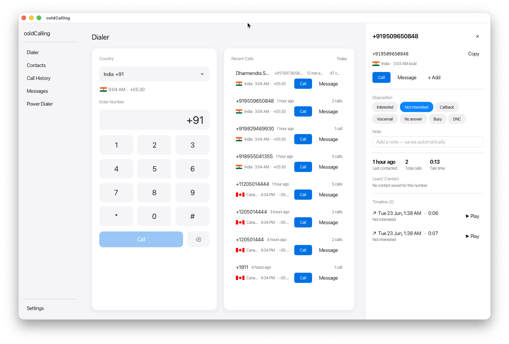
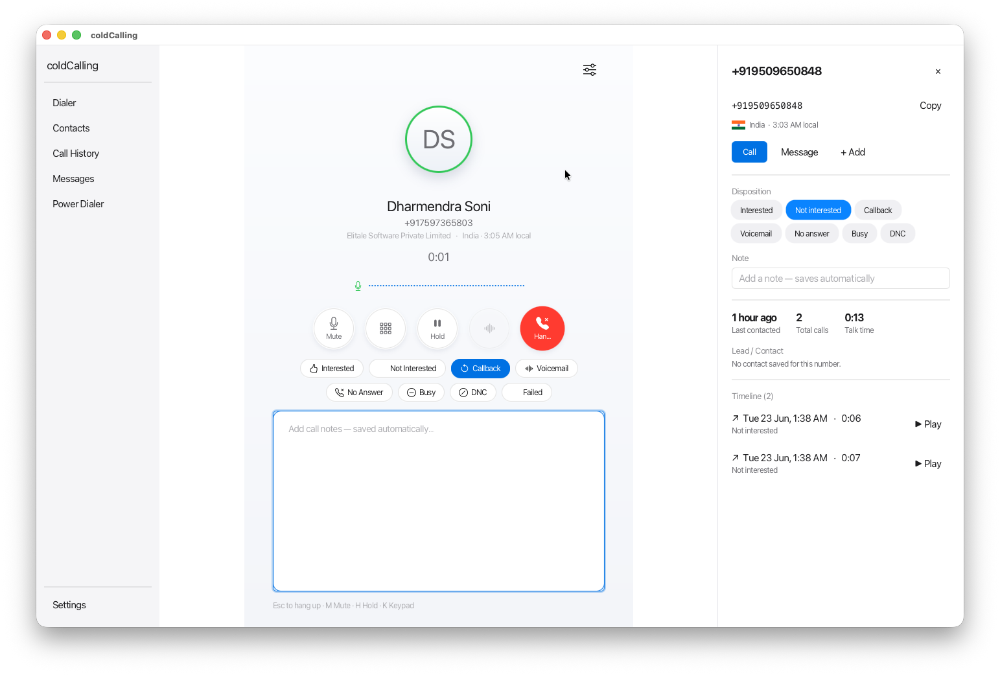
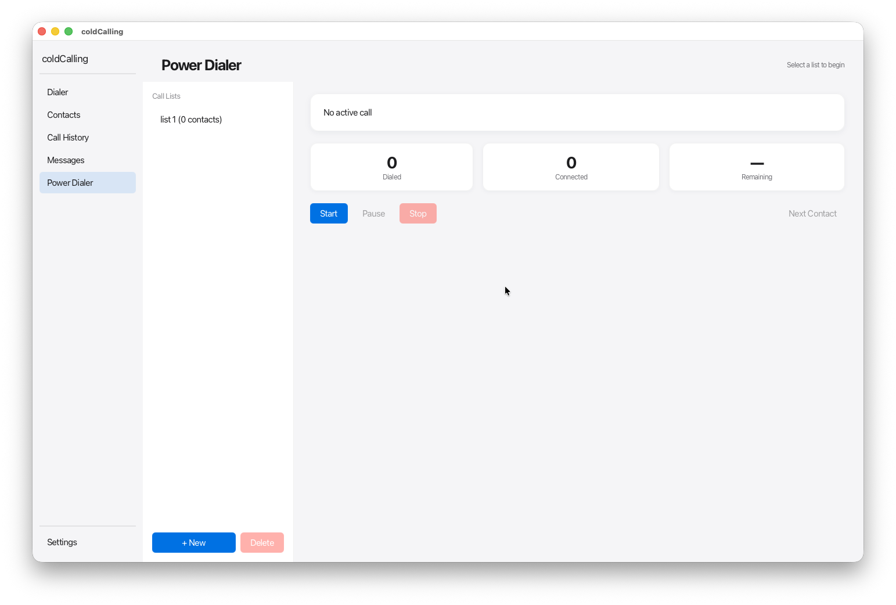
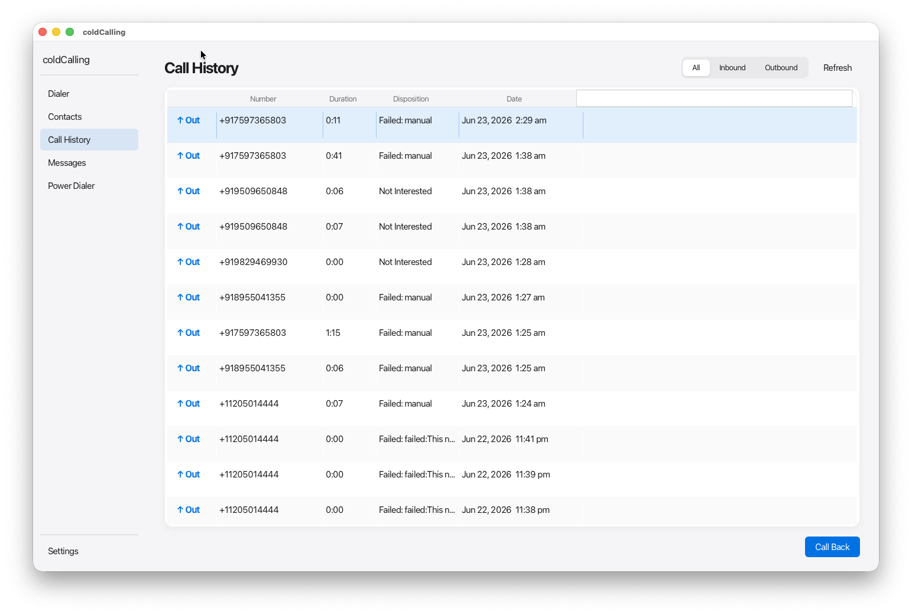
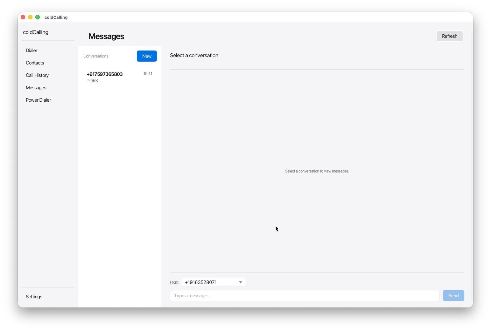

# coldCalling

A cross-platform desktop application for outbound and inbound cold calling. Part of the [coldBirds](https://coldbirds.com) outreach suite alongside [sequence](../sequence) (cold email).

Built with Java 21 + JavaFX 21. Pure SIP + RTP — no browser, no WebRTC. Ships as a native installer (DMG / MSI / DEB).

---

## Screenshots

<p align="center">
  <a href="screenshots/dialer.png"></a>
</p>
<p align="center">
  <b>Dialer</b> — dial pad with a country / caller-ID picker, a live <em>Recent Calls</em> feed, and a contact panel with one-tap dispositions, auto-saving notes, talk-time stats, and playable call recordings.
</p>

<table>
  <tr>
    <td width="50%" align="center" valign="top">
      <a href="screenshots/calling.png"></a>
      <br><br><b>Active Call</b>
      <br><sub>Mute · Keypad · Hold · Hang&nbsp;up with a real-time mic meter, one-tap dispositions (Interested, Callback, DNC…), and notes that save as you type.</sub>
    </td>
    <td width="50%" align="center" valign="top">
      <a href="screenshots/powerDialer.png"></a>
      <br><br><b>Power Dialer</b>
      <br><sub>Load a call list and auto-dial through it hands-free — Start / Pause / Stop with live Dialed / Connected / Remaining counters.</sub>
    </td>
  </tr>
  <tr>
    <td width="50%" align="center" valign="top">
      <a href="screenshots/history.png"></a>
      <br><br><b>Call History</b>
      <br><sub>Every inbound / outbound call with duration, disposition, and date — filter by direction, search, and call back in one click.</sub>
    </td>
    <td width="50%" align="center" valign="top">
      <a href="screenshots/messages.png"></a>
      <br><br><b>Messages</b>
      <br><sub>Two-way SMS threads per number — pick the sending number, type, and send; inbound texts arrive in real time.</sub>
    </td>
  </tr>
</table>

> Tip: click any screenshot to open it full-size.

---

## Table of Contents

- [Features](#features)
- [Screenshots](#screenshots)
- [Tech Stack](#tech-stack)
- [Architecture](#architecture)
- [Prerequisites](#prerequisites)
- [Local Setup](#local-setup)
- [Building](#building)
- [Running in Dev Mode](#running-in-dev-mode)
- [Running Tests](#running-tests)
- [Packaging (Native Installer)](#packaging-native-installer)
- [AWS Infrastructure (SMS Relay)](#aws-infrastructure-sms-relay)
- [Project Structure](#project-structure)
- [Database](#database)
- [Keyboard Shortcuts](#keyboard-shortcuts)
- [Contributing](#contributing)
- [License](#license)

---

## Features

- **Inbound + Outbound SIP calls** via Twilio (Twilio as fallback)
- **Power dialer** — auto-advance through a call list with configurable dispositions
- **Multi-number management** — purchase, rotate, and monitor reputation of phone numbers
- **SMS** — inbound via AWS WebSocket relay, outbound via Twilio REST
- **Call recording** stored locally as WAV files
- **Call history + analytics** — duration, dispositions, connect rate
- **DNC list enforcement** — checked before every outbound dial
- **Light / Dark / System-auto** theme (Apple HIG design system)
- **Native installers** — macOS DMG, Windows MSI, Linux DEB/RPM via jpackage

---

## Tech Stack

| Layer | Technology |
|---|---|
| Language | Java 21 (records, sealed interfaces, pattern matching, virtual threads) |
| UI | JavaFX 21 + AtlantaFX |
| SIP signaling | JAIN-SIP 1.3 |
| RTP / Audio | jlibrtp 0.2 + javax.sound.sampled |
| Audio codec | G.711 PCMU (8 kHz, 8-bit, mono) |
| NAT traversal | Custom STUN client — `stun.twilio.com:3478` |
| Telephony provider | Twilio REST API + SIP registration |
| SMS relay | AWS API Gateway WebSocket + Lambda + DynamoDB |
| Database | SQLite via sqlite-jdbc + FlywayDB migrations |
| HTTP client | Java 21 built-in `HttpClient` |
| JSON | Jackson 2 |
| Logging | SLF4J + Logback |
| Build | Gradle 8 multi-module |
| Packaging | jpackage (JDK built-in) |
| IaC | AWS CDK (TypeScript) |
| Tests | JUnit 5 + Mockito 5 + AssertJ |

---

## Architecture

```
┌─────────────────────────────────────────┐
│        UI Layer  (JavaFX / FXML)        │
│  Controllers · Bindings · AtlantaFX     │
├─────────────────────────────────────────┤
│         Service Layer (Business)        │
│  Call mgmt · Power dialer · SMS         │
├─────────────────────────────────────────┤
│    Telephony Layer  (SIP + RTP)         │
│  JAIN-SIP · jlibrtp · G.711 · STUN     │
├─────────────────────────────────────────┤
│       Providers  (External APIs)        │
│  Twilio REST · SMS WebSocket relay      │
├─────────────────────────────────────────┤
│    Repository Layer  (Data Access)      │
│  SQLite · FlywayDB · DAO pattern        │
├─────────────────────────────────────────┤
│         Domain Layer  (Pure)            │
│  Records · Sealed interfaces · Events  │
├─────────────────────────────────────────┤
│          SQLite  (~/.coldcalling/)      │
└─────────────────────────────────────────┘
```

**Module dependency rules** (strictly enforced — no cycles allowed):

```
domain    →  (no dependencies)
storage   →  domain
telephony →  domain
providers →  domain
ui        →  domain, storage, telephony, providers
app       →  all modules  (wiring only — no business logic)
infra     →  standalone TypeScript CDK project
```

**Threading model:**

| Thread | Purpose |
|---|---|
| FX Application Thread | All JavaFX rendering and event handling. Never block. |
| SIP Thread | JAIN-SIP internal thread. Dispatch immediately via `CompletableFuture`. |
| Audio Thread(s) | RTP send/receive + G.711 encode/decode. Never touch UI directly. |

Cross-thread rule: always use `Platform.runLater()` to update UI from SIP or audio threads.

---

## Prerequisites

| Tool | Version | Notes |
|---|---|---|
| JDK | 21+ | Tested with Eclipse Temurin 21. [Download](https://adoptium.net/) |
| Gradle | 8.8+ | The Gradle wrapper (`./gradlew`) is included — no separate install needed |
| Node.js | 20+ | Only required for the AWS CDK infra in `src/infra/` |
| AWS CLI | v2 | Only required for deploying the SMS relay |

> **macOS:** If `JAVA_HOME` is not set, the included `gradlew` script auto-detects the JDK installed via Homebrew at `/opt/homebrew/opt/openjdk@21`.
>
> **Windows:** Set `JAVA_HOME` to your JDK 21 installation directory before running Gradle.

You will also need a **Twilio account** to make real calls. A free trial account works for testing.

---

## Local Setup

### 1. Clone the repository

```bash
git clone https://github.com/elitale/coldcalling.git
cd coldcalling
```

### 2. Verify Java 21

```bash
java -version
# Expected: openjdk version "21.x.x" ...
```

### 3. Configure credentials

Credentials are **never stored in files**. The app reads them from environment variables on first launch and stores them in the OS keychain (macOS Keychain / Windows DPAPI / Linux libsecret).

For development, set the following environment variables in your shell profile or IDE run configuration:

```bash
# Twilio SIP credentials (from Twilio Mission Control → SIP Connections)
export COLDCALLING_SIP_USERNAME="+14155551234"
export COLDCALLING_SIP_PASSWORD="your-sip-password"

# Twilio API key (from Twilio Mission Control → API Keys)
export COLDCALLING_TWILIO_API_KEY="KEY0123456789ABCDEF"

# AWS — only needed if you are developing the SMS relay
export AWS_REGION="us-east-1"
export AWS_PROFILE="coldbirds-dev"          # or set AWS_ACCESS_KEY_ID / AWS_SECRET_ACCESS_KEY
export COLDCALLING_SMS_RELAY_URL="wss://your-api-id.execute-api.us-east-1.amazonaws.com/prod"
```

> For a pure local build without calling, you can skip the Twilio and AWS variables. The app starts in "offline" mode — the SIP registration will fail but the UI and database layers are fully functional.

### 4. (Optional) Set up the AWS SMS relay

The inbound SMS relay is a serverless stack in `src/infra/`. You only need this if you are developing the SMS feature.

```bash
cd src/infra
npm install
npx cdk bootstrap    # first time only
npx cdk deploy
```

The CDK stack outputs the WebSocket URL. Set it as `COLDCALLING_SMS_RELAY_URL` (see above).

---

## Building

Build all modules and run all tests:

```bash
./gradlew build
```

Build without running tests:

```bash
./gradlew assemble
```

Build a specific module:

```bash
./gradlew :domain:build
./gradlew :storage:build
./gradlew :telephony:build
```

A successful build produces a distributable ZIP at:

```
build/distributions/coldcalling-<version>.zip
```

---

## Running in Dev Mode

Run the desktop app directly from source (no packaging step needed):

```bash
./gradlew :app:run
```

JavaFX modules are automatically wired by the `javafxplugin`. The app uses the `data.db` SQLite file at:

- macOS / Linux: `~/.coldcalling/data.db`
- Windows: `%APPDATA%\coldcalling\data.db`

The database is created automatically on first launch and migrated via FlywayDB.

### Hot-reloading

Gradle does not hot-reload JavaFX. The fastest dev cycle is:

```bash
./gradlew :app:run --continuous
```

This restarts the app whenever source files change.

---

## Running Tests

Run the full test suite:

```bash
./gradlew test
```

Run tests for a single module:

```bash
./gradlew :domain:test
./gradlew :storage:test
./gradlew :telephony:test
```

Run a specific test class:

```bash
./gradlew test --tests "*.CallStateTest"
./gradlew test --tests "*.SqliteContactRepositoryTest"
```

Verbose output:

```bash
./gradlew test --info
```

### Coverage targets

| Module | Minimum |
|---|---|
| domain | 95% |
| storage | 85% |
| telephony | 80% |
| providers | 80% |
| ui | 60% |

---

## Packaging (Native Installer)

`jpackage` (bundled with JDK 21) builds a **native installer for the OS it runs on** — you
cannot cross-build (e.g. no Windows `.msi` from macOS). Build on each target OS, or let CI
build all three at once (see [All three platforms at once](#all-three-platforms-at-once-ci)).

```bash
./gradlew :app:jpackage     # installer for the current OS → src/app/build/jpackage/
```

| Host OS | Output | Extra tools required |
|---|---|---|
| macOS | `coldCalling-<version>.dmg` | — (Xcode CLT only for signing) |
| Windows | `coldCalling-<version>.msi` | [WiX Toolset v3](https://wixtoolset.org/) |
| Linux | `coldcalling_<version>_amd64.deb` | `fakeroot`, `binutils` |

Handy overrides:

```bash
./gradlew :app:jpackage -PappVersion=1.4.0       # stamp the installer version
./gradlew :app:jpackage -PpackageType=app-image  # unpacked app folder, no installer
# other types: macOS → pkg · Windows → exe · Linux → rpm
```

### All three platforms at once (CI)

Push a `v*` tag — or run the **Package** workflow manually — and the matrix in
[`.github/workflows/release.yml`](.github/workflows/release.yml) builds the `.dmg`, `.msi`,
and `.deb` on `macos-latest`, `windows-latest`, and `ubuntu-latest`, uploading each as a
downloadable artifact.

> **macOS code signing:** For distribution outside the App Store, pass `--mac-sign` with an Apple Developer ID certificate. For local dev builds, omit signing or use `-PpackageType=app-image` to skip the DMG step.

---

## AWS Infrastructure (SMS Relay)

Inbound SMS from Twilio flows through a small serverless relay:

```
Twilio webhook
  → POST /sms-inbound  (API Gateway HTTP)
  → Lambda             (stores to DynamoDB, looks up WebSocket connectionId)
  → WebSocket push     (API Gateway WebSocket)
  → Desktop app        (reconnects every 60s to keep the connection warm)
```

Outbound SMS goes directly from the desktop to the Twilio REST API — no AWS hop needed.

The CDK stack source is in `src/infra/`. To redeploy after changes:

```bash
cd src/infra
npm run build
npx cdk diff     # preview changes
npx cdk deploy
```

---

## Project Structure

```
coldcalling/
├── build.gradle                  # Root build — Java 21 toolchain, shared test deps
├── settings.gradle               # Module includes + JitPack repo
├── gradle/
│   └── libs.versions.toml        # Version catalog (all dependency versions)
├── gradlew / gradlew.bat         # Gradle wrapper (no separate Gradle install needed)
│
├── src/
│   ├── domain/                   # Pure domain — zero external dependencies
│   │   └── .../domain/
│   │       ├── event/            # DomainEvent (sealed interface)
│   │       ├── model/            # Entity records (Call, Contact, OwnedNumber, ...)
│   │       └── value/            # Value objects (PhoneNumber, CallState, Result, ...)
│   │
│   ├── storage/                  # SQLite repositories + FlywayDB migrations
│   │   └── .../storage/
│   │       ├── DatabaseManager.java
│   │       ├── repository/       # Repository interfaces (with NewXxx inner records)
│   │       └── sqlite/           # SQLite implementations + DomainMappers
│   │   resources/
│   │       └── db/migration/     # V1__initial_schema.sql, V2__..., ...
│   │
│   ├── telephony/                # SIP + RTP + audio pipeline
│   │   └── .../telephony/
│   │       ├── TelephonyService.java   # Public facade
│   │       ├── TelephonyConfig.java    # Configuration record
│   │       ├── audio/            # G711Codec, AudioPipeline, AudioDevices
│   │       ├── rtp/              # RtpSession (jlibrtp wrapper)
│   │       ├── sip/              # SipEngine, SipRegistrar, SdpBuilder
│   │       └── stun/             # StunClient (RFC 5389)
│   │
│   ├── providers/                # External API clients
│   │   └── .../providers/
│   │       ├── twilio/           # TwilioClient (REST), TwilioSmsService
│   │       └── relay/            # SmsRelayClient (AWS WebSocket)
│   │
│   ├── ui/                       # JavaFX controllers + FXML
│   │   └── .../ui/
│   │       ├── DialerController.java
│   │       ├── IncomingCallController.java
│   │       ├── ActiveCallController.java
│   │       ├── ContactsController.java
│   │       ├── CallHistoryController.java
│   │       ├── MessagesController.java
│   │       ├── PowerDialerController.java
│   │       └── SettingsController.java
│   │
│   ├── app/                      # Entry point + DI wiring (no business logic)
│   │   └── .../app/
│   │       └── ColdCallingApp.java
│   │
│   └── infra/                    # AWS CDK (TypeScript) — standalone, not a Gradle module
│       ├── lib/                  # CDK stack definitions
│       ├── bin/                  # CDK app entry point
│       └── package.json
│
├── .plan/
│   └── coldcalling.md            # Phased implementation roadmap
├── AGENTS.md                     # Coding standards + architecture reference
├── MEMORY.md                     # Session memory for AI coding agents
└── README.md                     # This file
```

---

## Database

SQLite database location:

| Platform | Path |
|---|---|
| macOS | `~/.coldcalling/data.db` |
| Linux | `~/.coldcalling/data.db` |
| Windows | `%APPDATA%\coldcalling\data.db` |

The database is created and migrated automatically at startup via FlywayDB.

**Adding a schema migration:** Never edit `V1__initial_schema.sql`. Create a new file:

```
src/storage/src/main/resources/db/migration/V2__description_here.sql
```

FlywayDB applies it on the next startup.

**Inspecting the database manually (macOS/Linux):**

```bash
sqlite3 ~/.coldcalling/data.db
.tables
SELECT * FROM contacts LIMIT 10;
```

---

## Keyboard Shortcuts

| Action | macOS | Windows / Linux |
|---|---|---|
| Answer incoming call | `Space` | `Space` |
| Hang up / Reject | `Escape` | `Escape` |
| Power dialer — advance | `Tab` | `Tab` |
| Drop voicemail | `V` | `V` |
| Add call note | `N` | `N` |
| Open dialer | `Cmd+D` | `Ctrl+D` |
| Open contacts | `Cmd+K` | `Ctrl+K` |

---

## Contributing

### Before you start

1. Read `AGENTS.md` — it is the single source of truth for all coding standards, architecture decisions, naming conventions, and layer rules. **No exceptions.**
2. Read `MEMORY.md` for current project state.
3. Read `.plan/coldcalling.md` for the phased implementation roadmap.

### Workflow

1. Fork the repository and create a branch: `feat/your-feature` or `fix/your-bug`.
2. Follow **TDD**: write failing tests first, then implement.
3. Run `./gradlew test` — all tests must be green before opening a PR.
4. Run `./gradlew build` — zero errors and zero warnings.
5. Open a pull request against `main`.

### Commit message format

Uses [Conventional Commits](https://www.conventionalcommits.org/):

```
feat: add voicemail drop to power dialer
fix: correct G.711 PCMU bias constant
refactor: extract SdpParser from SipEngine
chore: bump jain-sip-ri to 1.3.0-91
docs: add SMS relay architecture diagram
```

### Code style

- Java 21 strict mode — records, sealed interfaces, pattern matching.
- No `null` in public APIs. Use `Optional<T>` for nullable returns, `Result<T>` for failable operations.
- No `var` when the inferred type is non-obvious.
- No `System.out.println` — use SLF4J (`private static final Logger log = LoggerFactory.getLogger(Foo.class)`).
- No Swing imports. JavaFX only.
- No business logic in UI controllers or repositories.

See `AGENTS.md` for the full standards.

### Key invariants — never break these

- `domain/` has **zero** external dependencies.
- SIP and JDBC calls **never** happen on the FX Application Thread.
- DNC list is checked **before** every outbound dial — enforced at the service layer.
- Secrets (SIP password, API keys) are **never** stored in SQLite in plaintext.
- Every applied FlywayDB migration file is **immutable** — create a new version file instead.

---

## License

Copyright (c) 2026 Elitale. All rights reserved.

This project is not yet open-licensed. Contact [hello@coldbirds.io](mailto:hello@coldbirds.io) for licensing inquiries.
